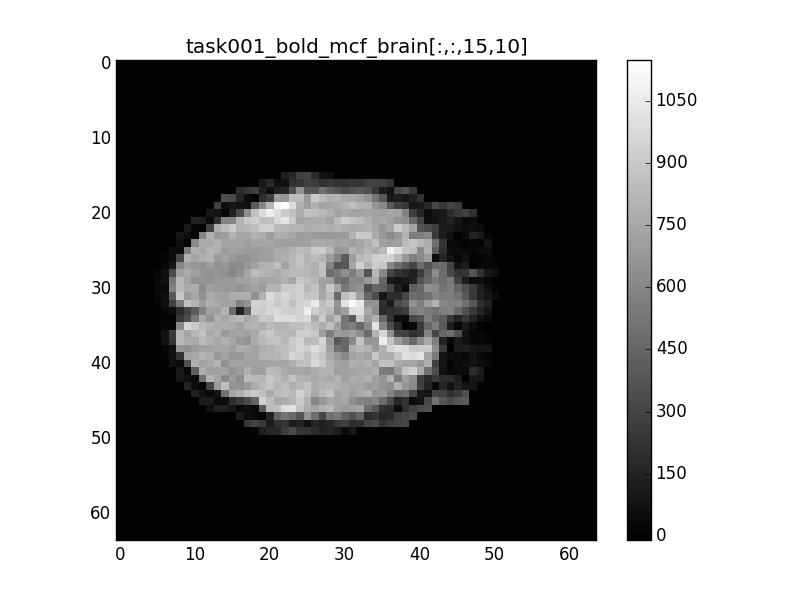
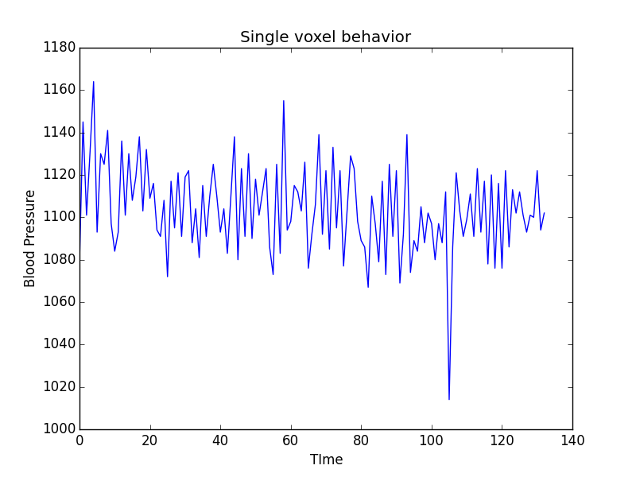
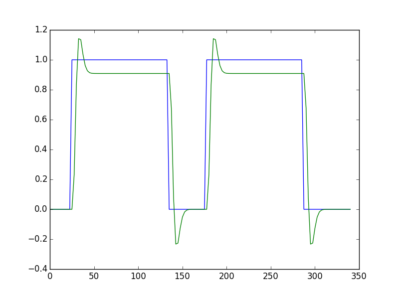
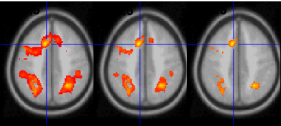

% Project Iota Progress Report
% Zeyu Li, Jie Li, Qingyuan Zhang, Chuan Yun 
% November 12, 2015

## The Paper

We choose "Working memory in healthy and schizophrenic individuals" from OpenFMRI.org, and we are interested in functional brain connectivity, which is known as neural networks. Here are the 4 particular regions of interest (ROIs) in the paper:

- Dorsal fronto-parietal network (FP).
- Cingulo-opercular network (CO).
- Cerebellar network (CER).
- "Default mode" network (DMN).

They showed that individuals with schizophrenia have reduced connectivity between neural networks.

## The Data

The data for this paper has 102 subjects. For each subject, they used fMRI scanning to find blood oxygen level dependent (BOLD) during resting state (R), and after 0-back (0B), 1-back (1B) and 2-back (2B) working memory task. Subjects are in four groups: 

- Individuals with schizophrenia (SCZ).
- Siblings of schizophrenia (SCZ-SIB).
- Healthy controls (CON).
- Siblings of controls (CON-SIB).

Since we don't have time to go through all of the subjects, we choose the first subject from SCZ group. If we have time, we will work on another subject from CON group and do a comparison between these two.

## Data Processing

We downloaded data from OpenFMRI.org and looked through all the files it has. We found that "ds115_sub001-005.tgz" contains the brain image of the subject we chose. 

- First, we checked all the files in it and found there are three tasks for our subject. 
- Second, we found that under each task there are four brain images. We thought one of them should be the raw image and the others were some-how processed by the authors. 
- Then, we plotted these four brain images and chose the most blurred one (This is probably because it is after smoothing), which is ``BOLD_mcf_brain.nii''. 

## Data Processing

## Data Processing

## Convolving with the Hemodynamic Response

Similar to what we did in class, we used HRF function to convolve our neural prediction, This will give us a hemodynamic prediction, under the linear-time-invariant assumptions of the convolution. This is a very important step because we will use convolution data in our linear modeling process in the future. Here is the comparison between the original neural prediction and convolved.

## Convolving with the Hemodynamic Response

## Simplified Objectives

The paper's objective is finding connectivity within and between each ROI on different tasks. They extracted these ROIs and worked directly on them. Since we do not have the knowledge about partition the brain into ROIs, we could not do the same analysis as them. Therefore, we will simply focus on the entire brain and find the region related to these tasks. 

## Statistical Analysis: Linear Modeling

- Data cleaning: focusing on cleaning outliers in order to keep normality assumption

- Perform a statistical test (p-value map) to determine whether a task related blood pressure in the each slice

- Non-constant variance of error: construct a generalized linear regression (WLS) to weighted different variance for each voxel of the brain

## Statistical Analysis: Linear Modeling

## Statistical Analysis: Sparse Inverse Covariance

The matrix inverse of the covariance matrix (the precision matrix) is proportional to the partial correlation matrix. It gives the partial independence relationship. In other words, if two features are independent conditionally on the others, the corresponding coefficient in the precision matrix will be zero. By learning independence relations from the data, the estimation of the covariance matrix is better conditioned. 

Since the estimate of covariance matrix of beta_hat might not be precious, so we think sparse inverse covariance should be a good way to solve this issue.

## Statistical Analysis: Time Series

- Based on the beta_hat generated from linear regression, we are finding the sub-area has the significantly effect between blood pressure and nerual signal.

- Using differecing method to remove the noise between each lag and plot the ACF and PACF to understand how the sub-area works when time is moving on.

- Using boostraping method to simulate our samples from the sub-area, and develop the time series model (ARMA, ARIMA) to predict future blood pressure.

## Our Process

1. Task assignment
2. Git workflow, python
3. Issues that we faced and how we addressed them 
	- Data organization
	- fMRI 
	- Coding multiple regression model and tests 

# Current Analysis Progress

## Linear Model

1. Regression: relationship between a response/outcome (dependent) variable and one or more explanatory (independent) variables (regressors).
2. Simple Regression (Linear Model) : fit data with a straight line.
3. Mathematical Model:
	- $\bold{y} = \bold{X} \boldsymbol{\beta} + \boldsymbol{\epsilon}, \bold{X} = [1, x_1, x_2, ..., x_k]$ 
	- Assumptions:
		+ Linearity
		+ The conditional variance of the error term given $\bold{X}$ is a known matrix $\boldsymbol{\Omega}$.
		+ $E [ \boldsymbol{\epsilon} | \bold{X} ] = 0$, $Var [ \boldsymbol{\epsilon} | \bold{X} ] = \boldsymbol{\Omega}$

4. Solution for linear regression $\bold{y} = \bold{X} \boldsymbol{\beta} + \boldsymbol{\epsilon}$:
	- Project data $\bold{y}$ onto the space of explanatory variables ($\bold{X}$)
	- Generalized Least Square: $\hat{\boldsymbol{\beta}} = (\bold{X}^T \boldsymbol{\Omega}^{-1} \bold{X})^{-1} \bold{X}^T \boldsymbol{\Omega}^{-1} \bold{Y}$ 
	- Student t-test for each $\beta_i   (H_0: \beta_i = 0, i = [1, 2, ..., k]$

##FMRI Data

1. Data partition: Data = Signal + Noise
	- Data = acquisition from scanner (voxel-wise time series)
	- Signal = BOLD response to stimulus; effects of interest + no interest
		+ We don't really know the real signal 
		+ Look for idealized components, or search for signal via repeated trials
		+ Of interest: effect size (response amplitude) for each condition: beta
		+ Of no interest: baseline, slow drift, head motion effects, ...
	- Noise = components in data that interfere with signal
		+ Practically the part we have don't know and/or we don't care about; that is, noise is the part we can't explain in the modelm
		+ Will have to make some assumptions about its distribution
2. Data = $baseline + slow drift + other$ $effects$ $of$ $no$ $interest + response_1 + ... + response_k + noise$

## Hemodynamic Function (HDF)

1. HDF for Block Design
	1. Assuming a $h(t)$ for IRF to an instantaneous stimulus
	2. For each block, $h(t)$ is convolved with stimulus timing and duration ($d$) to get idealized response (temporal pattern) as an explanatory variable (regressor): BLOCK($d$, $p$)
		- Equivalent to convolving a series of consecutive events
		- Linearity assumed within each block: plateau-like response
		- $p$: scale HDF to 1 for easy interpretation of $\boldsymbol{\beta}$
2. HDF for Event-Related Design
	1. $h(t)$ for IRF to an instamntaneous stimulus
	2. For multiple events of a condition/task, $h(t)$ is convolved with stimulus timing to get idealized response (temporal pattern) as an explanatory variable (regressor): GAM($p$, $q$)
		- Linearity assumed when events are close with each other: overlapping impulse responses

##Linear Model with IRF

1. FMRI data = $baseline + slow drift + othmer$ $effects$ $of$ $no$ $interest + response_1 + ... + response_k + noise$
2. 'baseline' = $baseline + drift + other$ $effects$ $of$ $no$ $interest$
	- Drift: psychological/physiological effect, thermal fluctuation
	- Data = 'baseline' + $effects$ $of$ $interest$ + $noise$
	- $Baseline$ condition (and drift) is treated in AFNI as $baseline$, an additive effect, not an effect of interest
3. $\bold{y} = \bold{X} \boldsymbol{\beta} + \boldsymbol{\epsilon}, \bold{X} = [1, t, t^2, x_1, x_2, ..., x_k, ...]$ (There are two more terms with $t$ and $t^2$)
4. In AFNI $baseline$ + slow drift is modeled with polynomials
	- A longer run needs a higher order of polynomials
	- With m runs, m separate sets of polynomials needed to account for temporal discontinuities across runs
		+ $m(p+1)$ columns for $baseline$ + slow drift: with $p$-order polynomials
5. Other typical effects of no interest: head motion effects

##Design Matrix with IRF

1. Voxel-wise (massively univariate) linear model: $\bold{y} = \bold{X} \boldsymbol{\beta} + \boldsymbol{\epsilon}$
	- $\bold{X}$: explanatory variables (regressors), same across voxels
	- $\bold{y}$: data (time series) at a voxel, different across voxels
	- $\boldsymbol{\beta}$: regression coefficients (effects), different across voxels
	- $\boldsymbol{\epsilon}$: anything we can't account for, different across voxels
2. Visualizing design matrix $\bold{X} = [1, t, t^2, x_1, x_2, ..., x_k, ...]$ in grayscale

## Plots

