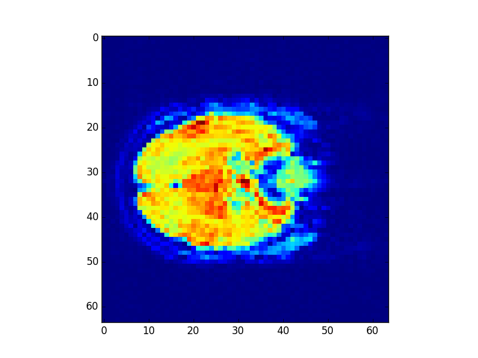

% Project Iota Progress Report
% Zeyu Li, Jie Li, Qingyuan Zhang, Chuan Yun 
% November 12, 2015

# Background

## The Paper

We choose "Working memory in healthy and schizophrenic individuals" from OpenFMRI.org, and we are interested in functional brain connectivity, which is known as neural networks. Here are the 4 particular regions of interest (ROIs) in the paper:

- Dorsal fronto-parietal network (FP).
- Cingulo-opercular network (CO).
- Cerebellar network (CER).
- "Default mode" network (DMN).

## The Data

The data we use for this paper is "ds115_sub001-005.tgz", which has 12 subjects. For each subject, fMRI scanning during resting state (R), and after 0-back (0B), 1-back (1B) and 2-back (2B) working memory task. Subjects are in four groups: 

- Individuals with schizophrenia (SCZ).
- Siblings of schizophrenia (SCZ-SIB).
- Healthy controls (CON).
- Siblings of controls (CON-SIB).

# Initial Work

## Data Processing

We downloaded data from OpenFMRI.org and looked through all the files it has. We want to make sure that the data we downloaded matches the description in the paper. 

- First, we found that there are four datasets. We thought one of them should be the raw data and the others were some-how processed by the authors . 
- Then, we did some sample plots for each dataset to see the differences between their brain images.
- Finally, we knew which on is the raw data set and we will use it in our analysis. 

## Data Processing

## Data Processing

edit:   \

## Convolving with the Hemodynamic Response

Similar to what we did in class, we used HRF function to convolve our neural prediction, This will give us a hemodynamic prediction, under the linear-time-invariant assumptions of the convolution. This is a very important step because we will use convolution data in our linear modeling process in the future. Here is the comparison between the original neural prediction and convolved.

## Convolving with the Hemodynamic Response

# Our Plan

## Simplified Objectives

The paper's objective is finding connectivity within and between each ROI on different tasks. Since we do not have the knowledge about partition the brain into ROIs, we will simply focus on the entire brain and find the region related to these tasks. Also, different subjects have different brain shapes, and the related regions might vary from participants to participants. To make it easier, we will just ignore their differences and simply visually compare brain images.

## Statistical Analysis: Linear Modeling

## Statistical Analysis: Sparse Inverse Covariance

The matrix inverse of the covariance matrix (the precision matrix) is proportional to the partial correlation matrix. It gives the partial independence relationship. In other words, if two features are independent conditionally on the others, the corresponding coefficient in the precision matrix will be zero. By learning independence relations from the data, the estimation of the covariance matrix is better conditioned. 

We 

## Statistical Analysis: Time Series

## Potential Problems

- Problems

# Our Process

## Linear Modeling

