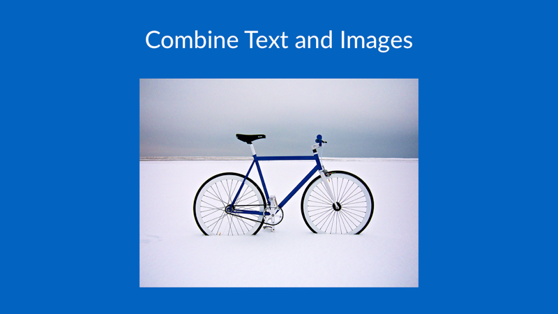

% Project Aleph Progress Report
% Zeyu Li, Jie Li, Qingyuan Zhang, Chuan Yun 
% November 12, 2015

# Background

## The Paper

We choose "Working memory in healthy and schizophrenic individuals" from OpenFMRI.org, and we are interested in functional brain connectivity, which is known as neural networks. Here are the 4 particular regions of interest (ROIs) in the paper:

- Dorsal fronto-parietal network (FP).
- Cingulo-opercular network (CO).
- Cerebellar network (CER).
- "Default mode" network (DMN).

## The Data

The data we use for this paper is "ds115_sub001-005.tgz", which has 12 subjects. For each subject, fMRI scanning during resting state (R), and after 0-back (0B), 1-back (1B) and 2-back (2B) working memory task. Subjects are in four groups: 

- Individuals with schizophrenia (SCZ).
- Siblings of schizophrenia (SCZ-SIB).
- Healthy controls (CON).
- Siblings of controls (CON-SIB).

# Initial Work

## Data Processing

We downloaded data from OpenFMRI.org and looked through all the files it has. We want to make sure that the data we downloaded matches the description in the paper. 

First, we found that there are four datasets. We thought one of them should be the raw data and the others were some-how processed by the authors . 

Then, we did some sample plots for each dataset to see the differences between their brain images.

Finally, we knew which on is the raw data set and we will use it in our analysis. 

## Sample Plots

# Next steps

## Preprocessing / Validation

- PCA

## Statistical Analysis

- linear model

## Objectives

Original Paper Objectives:
1. Within-network connectivity:
(a) For each participant, find connectivity within each ROI on different tasks.
2. Between-network connectivity:connectivity
(a) For each participant, find connectivity between each ROI on different tasks.

Our Project Objectives:
1.Simplified assumptions:
(a) Since we do not have the knowledge about partition the brain into ROIs, we will simply focus on the entire brain.
(b) Since we do not have the knowledge of comparing different subjects who have different brain shapes, we will simply visually compare brain images and approximate.
2. For each subject Identify signal strength in response to stimulus.  

